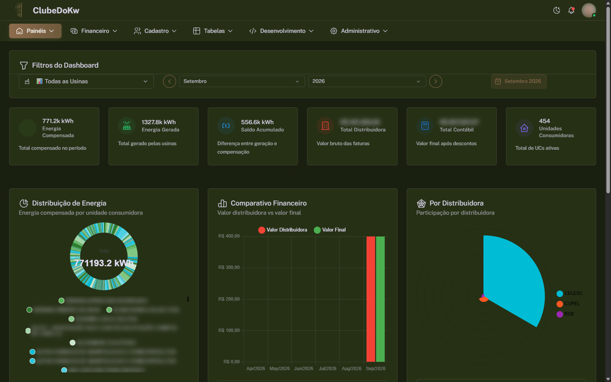
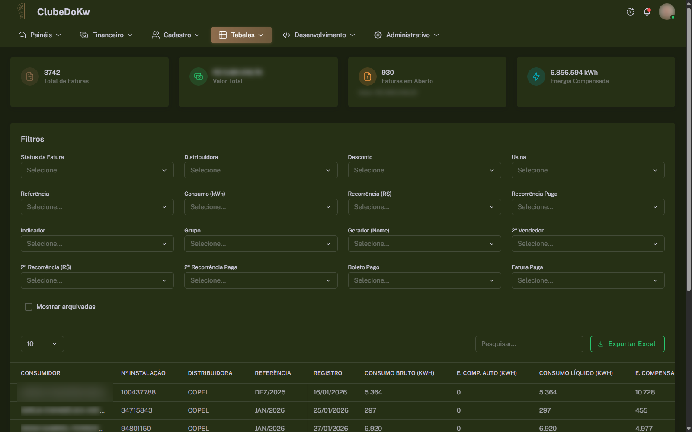
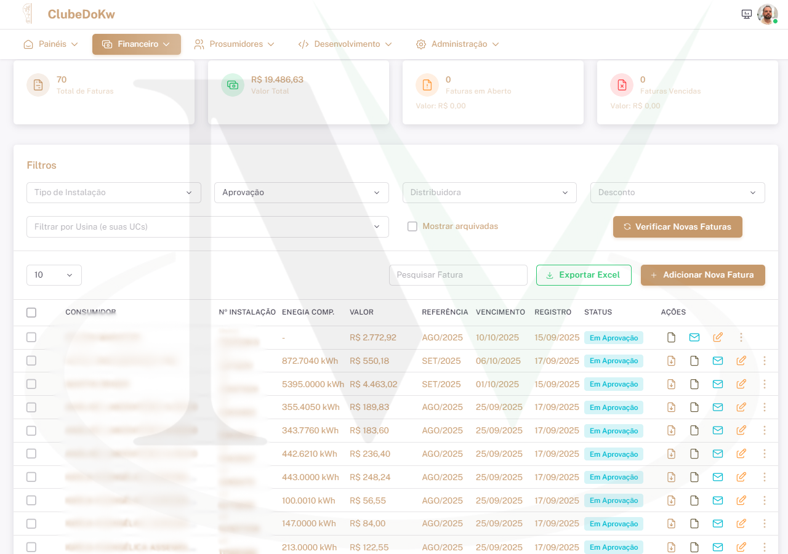
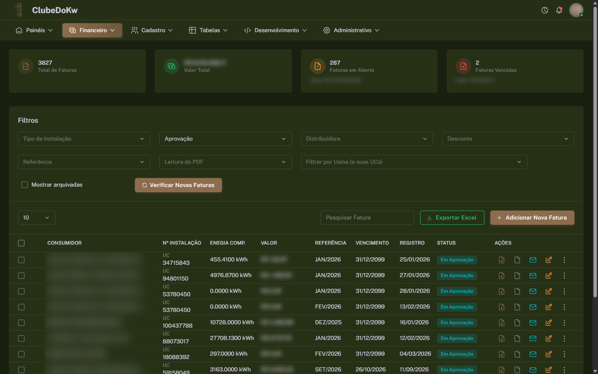
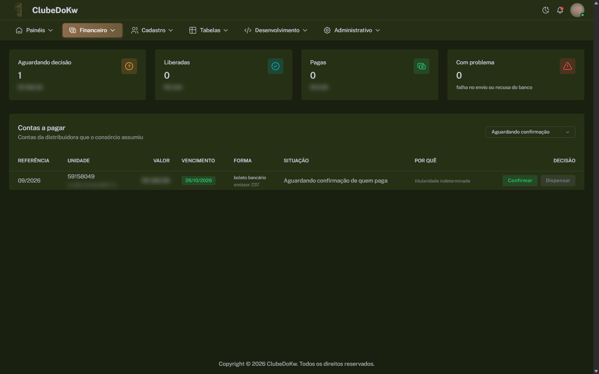
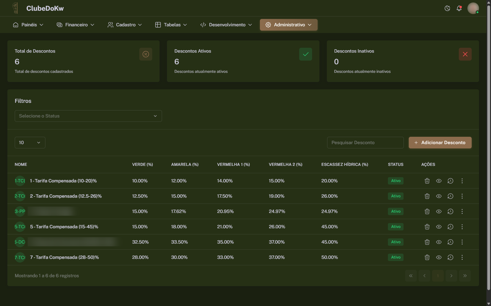
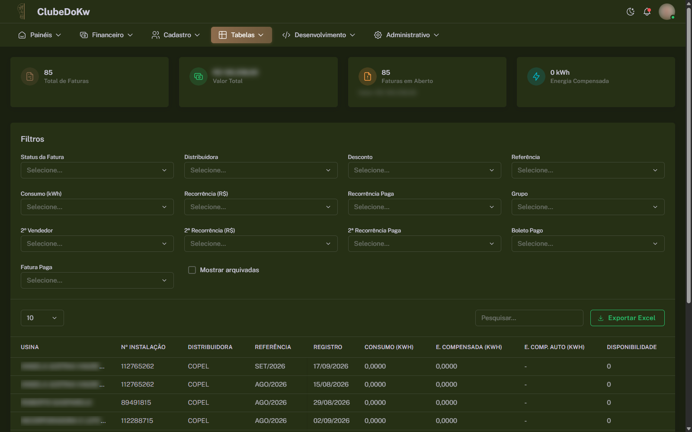
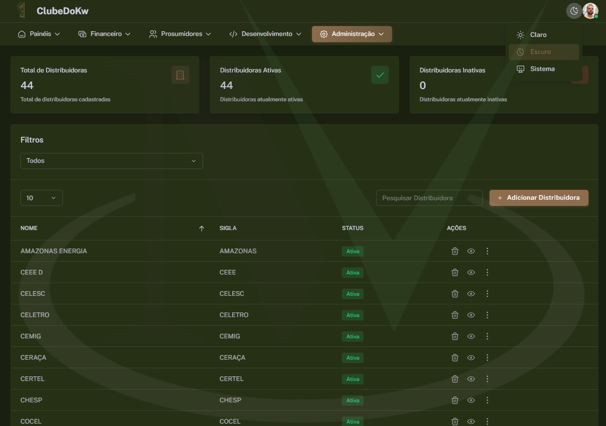
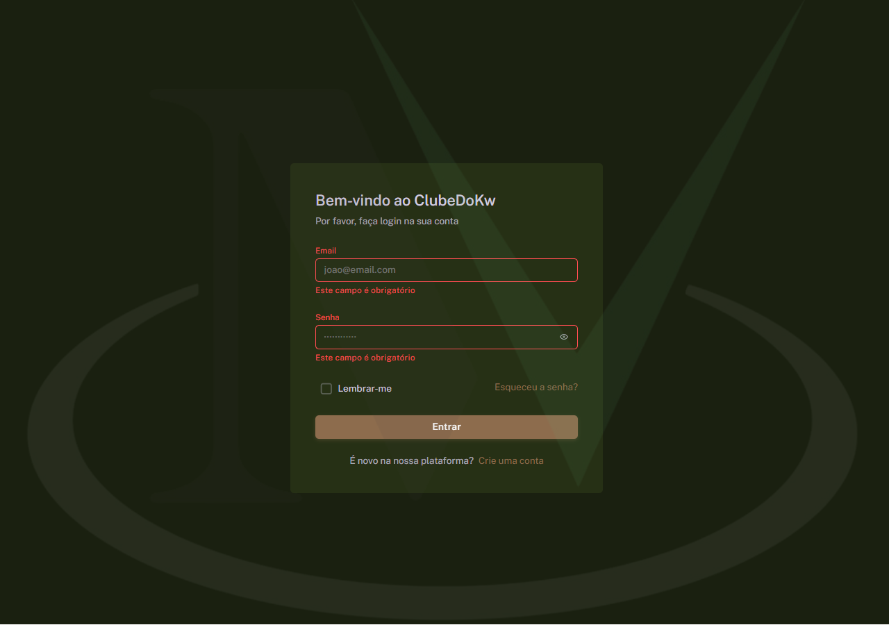

  <!-- Languages: -->
  <a title="Português" href="README_ptbr.md">🇧🇷 Português</a>

# Clube do KW ☀️⚡

**Clube do KW** is a comprehensive management system for photovoltaic energy companies, offering customer control, distributor management, financial analysis, team management, and solar installation monitoring with real-time dashboards.

---

## Features ✨

- **Consumer Management** 👥: Complete registration and tracking of photovoltaic customers
- **Distributor Control** 🏢: Management of partnerships with energy distributors
- **Analytics Dashboard** 📊: Real-time metrics of energy production and consumption
- **Financial System** 💰: Invoice control, generated savings, and system ROI
- **Team Management** 👷: Role and permission control for installers and technicians
- **Detailed Reports** 📈: Performance and energy savings analysis

---

## Technologies Used 🛠️

### Backend

- **Django 5.0 + REST Framework** 🐍: Robust and scalable API with Python
- **PostgreSQL** 🐘: Relational database for structured data
- **Redis + Celery** 🔄: Background task processing and cache
- **Django Channels** 🌐: WebSocket for real-time updates

### Frontend

- **Vue 3 + Composition API** ⚡: Modern and reactive JavaScript framework
- **TypeScript** 📘: Static typing for greater code security
- **Vuetify 3** 🎨: Material Design component library
- **Pinia** 🍍: Intuitive and performant state management

### Infrastructure

- **Docker + Docker Compose** 🐳: Containerization for development and production
- **GitHub Actions** 🚀: Automated CI/CD with continuous deployment
- **Nginx** 🌐: High-performance web server
- **Gunicorn + Daphne** 🦄: ASGI/WSGI servers for Django

---

## System Flow 💼

### Solar Energy Management

1. **Consumer Registration**: Record of customers with photovoltaic systems
2. **Consumption Analysis**: Monitoring of energy production and savings
3. **Distributor Integration**: Management of energy credits and compensation
4. **Performance Reports**: Dashboards with efficiency metrics
5. **Preventive Maintenance**: Alerts and maintenance scheduling

### Financial System

- **ROI Analysis**: Return on investment calculation
- **Generated Savings**: Monthly tracking of electricity bill savings
- **Invoice Management**: Control of payments and energy credits
- **Financial Projections**: Future savings estimates

---

## Architecture 🏗️

### Backend Structure

- **apps/financeiro**: Complete financial management and invoice system
- **apps/dashboard**: Metrics and energy production analytics
- **apps/pages**: Informative pages and help center
- **apps/websocket**: Real-time communication for updates
- **authentication**: Authentication and access control system
- **tasks**: Asynchronous processing with Celery

### Frontend Structure

- **@core**: Fundamental components and utilities
- **@layouts**: Templates and page structures
- **composables**: Reusable logic with Composition API
- **pages**: Application routes and pages
- **stores**: State management with Pinia
- **types**: TypeScript definitions for type-safety

### Security & Performance

- **JWT Authentication**: Secure tokens with automatic refresh
- **Rate Limiting**: Protection against API abuse
- **Redis Cache**: Optimization of frequent queries
- **Lazy Loading**: On-demand component loading

---

## Authors 👥

- **@miltonvo** 👨‍💻: Lead developer and system architect

---

## Demonstration 📺

|  |  |  |
|:------------------------:|:------------------------:|:------------------------:|
| Main Dashboard | Analytics Dashboard | Financial System |

|  |  |  |
|:------------------------:|:------------------------:|:------------------------:|
| Consumers Management | Edit Consumers | Administrative Panel |

|  |  |  |
|:------------------------:|:------------------------:|:------------------------:|
| Roles Management | Distributors | Login Screen |

🔗 **Watch the system in action** ⬇️

---

📄 Full case study on the MV Dev Solutions website: [https://mvdevsolutions.com.br/en/projects/clube-do-kw-photovoltaic-energy-management-system](https://mvdevsolutions.com.br/en/projects/clube-do-kw-photovoltaic-energy-management-system)
